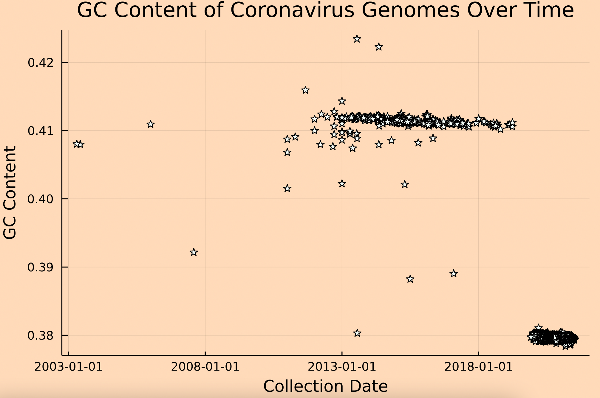
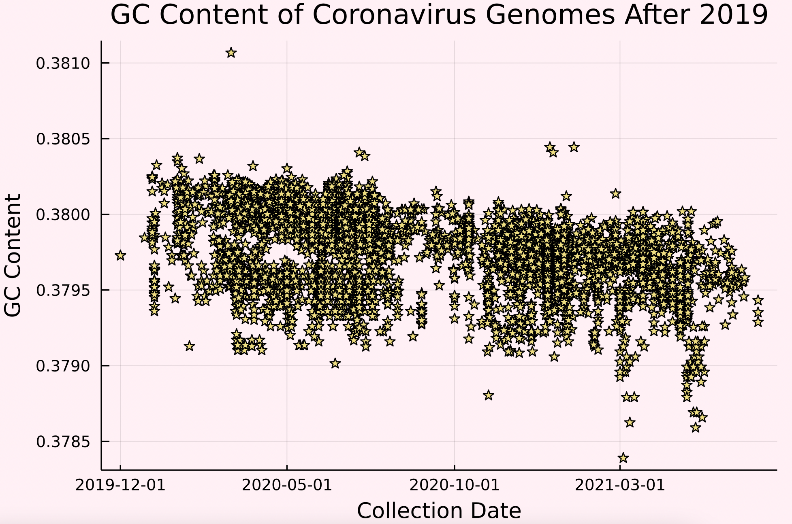

# GC Content Analysis
In this notebook, we will be analyzing the genomes found in *.../data/selectedSARSgenomes.fasta* through the lens of gc content across time.

First, let's grab our data! In the Kmer Analysis, we parsed and saved all the data in files for easy loading.

```julia
julia> using JLD2, FileIO

julia> headerVec = load("../data/genomeData.jld2", "headerVec")
5774-element Vector{Any}:
 "NC_045512.2 |Severe acute respiratory syndrome-related coronavirus||China|2019-12"
 "MZ573077.1 |Severe acute respiratory syndrome-related coronavirus||Bahrain|2021-07-05"
 "MZ573079.1 |Severe acute respiratory syndrome-related coronavirus||Bahrain|2021-07-05"
 "MZ573080.1 |Severe acute respiratory syndrome-related coronavirus||Bahrain|2021-07-05"
 "MZ572200.1 |Severe acute respiratory syndrome-related coronavirus||India|2021-06-01"
 "MZ572201.1 |Severe acute respiratory syndrome-related coronavirus||India|2021-06-01"
 "MZ572203.1 |Severe acute respiratory syndrome-related coronavirus||India|2021-06-01"
 "MZ572204.1 |Severe acute respiratory syndrome-related coronavirus||India|2021-06-04"
 "MZ572206.1 |Severe acute respiratory syndrome-related coronavirus||India|2021-06-09"
 "MZ572207.1 |Severe acute respiratory syndrome-related coronavirus||India|2021-06-14"
 "MZ571142.1 |Severe acute respiratory syndrome-related coronavirus|oronasopharynx|Morocco|2021-04-22"
 "MZ562707.1 |Severe acute respiratory syndrome-related coronavirus|oronasopharynx|Pakistan|2021-04-30"
 "MZ562746.1 |Severe acute respiratory syndrome-related coronavirus||India: Madhya Pradesh|2021-03-07"
 "MZ562747.1 |Severe acute respiratory syndrome-related coronavirus||India: Madhya Pradesh|2021-03-07"
 "MZ562748.1 |Severe acute respiratory syndrome-related coronavirus||India: Madhya Pradesh|2021-03-08"
 "MZ562749.1 |Severe acute respiratory syndrome-related coronavirus||India: Madhya Pradesh|2021-03-08"
 "MZ562750.1 |Severe acute respiratory syndrome-related coronavirus||India: Madhya Pradesh|2021-03-08"
 "MZ562751.1 |Severe acute respiratory syndrome-related coronavirus||India: Madhya Pradesh|2021-03-07"
 "MZ562752.1 |Severe acute respiratory syndrome-related coronavirus||India: Madhya Pradesh|2021-02-08"
 "MZ562753.1 |Severe acute respiratory syndrome-related coronavirus||India: Madhya Pradesh|2021-02-08"
 ⋮
 "AY502925.1 |Severe acute respiratory syndrome-related coronavirus||Taiwan|"
 "AY502926.1 |Severe acute respiratory syndrome-related coronavirus||Taiwan|"
 "AY502927.1 |Severe acute respiratory syndrome-related coronavirus||Taiwan|"
 "AY502928.1 |Severe acute respiratory syndrome-related coronavirus||Taiwan|"
 "AY502929.1 |Severe acute respiratory syndrome-related coronavirus||Taiwan|"
 "AY502930.1 |Severe acute respiratory syndrome-related coronavirus||Taiwan|"
 "AY502931.1 |Severe acute respiratory syndrome-related coronavirus||Taiwan|"
 "AY502932.1 |Severe acute respiratory syndrome-related coronavirus||Taiwan|"
 "AY313906.1 |Severe acute respiratory syndrome-related coronavirus||China: Jiangmen, Guangdong|"
 "AY304486.1 |Severe acute respiratory syndrome-related coronavirus||Hong Kong|"
 "AY304488.1 |Severe acute respiratory syndrome-related coronavirus||Hong Kong|"
 "AY304495.1 |Severe acute respiratory syndrome-related coronavirus||Hong Kong|"
 "AY348314.1 |Severe acute respiratory syndrome-related coronavirus||Taiwan|"
 "AY291451.1 |Severe acute respiratory syndrome-related coronavirus||Taiwan|"
 "AY283794.1 |Severe acute respiratory syndrome-related coronavirus||Singapore|"
 "AY283795.1 |Severe acute respiratory syndrome-related coronavirus||Singapore|"
 "AY283796.1 |Severe acute respiratory syndrome-related coronavirus||Singapore|"
 "AY283797.1 |Severe acute respiratory syndrome-related coronavirus||Singapore|"
 "AY283798.2 |Severe acute respiratory syndrome-related coronavirus||Singapore|"
 "AY278554.2 |Severe acute respiratory syndrome-related coronavirus||China: Hong Kong, Prince of Wales Hospital|"

julia> sequenceVec = load("../data/genomeData.jld2", "sequenceVec")
# output not shown here because it is too long and honestly not helpful to look at
```

Our goal here is to look at the gc content of these sequences across time, but it seems as thought some of these sequences don't have a collection date available. Unfortunately, we will have to exclude these data points from our analysis due to that lack of information. Let's narrow down our data before we do any big calculations.

```julia
julia> using BioinformaticsBISC195

julia> headerVec, sequenceVec = filterByEmptyAttrib(headerVec, sequenceVec, "|", 5)

julia> headerVec
5701-element Vector{Any}:
 "NC_045512.2 |Severe acute respiratory syndrome-related coronavirus||China|2019-12"
 "MZ573077.1 |Severe acute respiratory syndrome-related coronavirus||Bahrain|2021-07-05"
 "MZ573079.1 |Severe acute respiratory syndrome-related coronavirus||Bahrain|2021-07-05"
 "MZ573080.1 |Severe acute respiratory syndrome-related coronavirus||Bahrain|2021-07-05"
 "MZ572200.1 |Severe acute respiratory syndrome-related coronavirus||India|2021-06-01"
 "MZ572201.1 |Severe acute respiratory syndrome-related coronavirus||India|2021-06-01"
 "MZ572203.1 |Severe acute respiratory syndrome-related coronavirus||India|2021-06-01"
 "MZ572204.1 |Severe acute respiratory syndrome-related coronavirus||India|2021-06-04"
 "MZ572206.1 |Severe acute respiratory syndrome-related coronavirus||India|2021-06-09"
 "MZ572207.1 |Severe acute respiratory syndrome-related coronavirus||India|2021-06-14"
 "MZ571142.1 |Severe acute respiratory syndrome-related coronavirus|oronasopharynx|Morocco|2021-04-22"
 "MZ562707.1 |Severe acute respiratory syndrome-related coronavirus|oronasopharynx|Pakistan|2021-04-30"
 "MZ562746.1 |Severe acute respiratory syndrome-related coronavirus||India: Madhya Pradesh|2021-03-07"
 "MZ562747.1 |Severe acute respiratory syndrome-related coronavirus||India: Madhya Pradesh|2021-03-07"
 "MZ562748.1 |Severe acute respiratory syndrome-related coronavirus||India: Madhya Pradesh|2021-03-08"
 "MZ562749.1 |Severe acute respiratory syndrome-related coronavirus||India: Madhya Pradesh|2021-03-08"
 "MZ562750.1 |Severe acute respiratory syndrome-related coronavirus||India: Madhya Pradesh|2021-03-08"
 "MZ562751.1 |Severe acute respiratory syndrome-related coronavirus||India: Madhya Pradesh|2021-03-07"
 "MZ562752.1 |Severe acute respiratory syndrome-related coronavirus||India: Madhya Pradesh|2021-02-08"
 "MZ562753.1 |Severe acute respiratory syndrome-related coronavirus||India: Madhya Pradesh|2021-02-08"
 ⋮
 "KF600632.1 |Middle East respiratory syndrome-related coronavirus||Saudi Arabia|2013-05-23"
 "KF600634.1 |Middle East respiratory syndrome-related coronavirus||Saudi Arabia|2013-05-30"
 "KF600644.1 |Middle East respiratory syndrome-related coronavirus||Saudi Arabia|2013-05-12"
 "KF600645.1 |Middle East respiratory syndrome-related coronavirus||Saudi Arabia|2013-05-11"
 "KF600647.1 |Middle East respiratory syndrome-related coronavirus||Saudi Arabia|2013-05-15"
 "KF600651.1 |Middle East respiratory syndrome-related coronavirus||Saudi Arabia|2013-05-23"
 "KF600652.1 |Middle East respiratory syndrome-related coronavirus||Saudi Arabia|2012-10-30"
 "KC869678.4 |Middle East respiratory syndrome-related coronavirus||South Africa|2011"
 "JX993987.1 |Severe acute respiratory syndrome-related coronavirus||China|2011-09"
 "JX993988.1 |Severe acute respiratory syndrome-related coronavirus||China|2011"
 "KF186564.1 |Middle East respiratory syndrome-related coronavirus||Saudi Arabia|2013-05-01"
 "KF186565.1 |Middle East respiratory syndrome-related coronavirus||Saudi Arabia|2013-04-22"
 "KF186566.1 |Middle East respiratory syndrome-related coronavirus||Saudi Arabia|2013-04-21"
 "KF186567.1 |Middle East respiratory syndrome-related coronavirus||Saudi Arabia|2013-05-09"
 "KF192507.1 |Middle East respiratory syndrome-related coronavirus||United Arab Emirates|2013"
 "KC776174.1 |Middle East respiratory syndrome-related coronavirus|lung|Jordan|2012-04"
 "GU553363.1 |Severe acute respiratory syndrome-related coronavirus||China: Hong Kong|2003-06-07"
 "GU553364.1 |Severe acute respiratory syndrome-related coronavirus||China: Hong Kong|2003-06-07"
 "FJ588686.1 |Severe acute respiratory syndrome-related coronavirus||China|2006"
 "DQ182595.1 |Severe acute respiratory syndrome-related coronavirus||China: Hangzhou|2003-04-21"
```

We didn't lose too much data. That's great! Next, let's create a corresponding vector that contains the gc content of each sequence.

```julia
julia> gcContentVec = map(gc_content, sequenceVec)
5701-element Vector{Float64}:
 0.3797277865097147
 0.3792884158382702
 0.3793519418289046
 0.3794315556894647
 0.3795534665099882
 0.37955910478810856
 0.3797430133861174
 0.3795488116019874
 0.37969886992387913
 0.3795463696148168
 0.3799047555168019
 0.37967215312929503
 0.37976338103696755
 0.37981429960111285
 0.3799356438962258
 0.3798927613941019
 0.3796619264824255
 0.3797022731844699
 0.3796674934638332
 0.37982444384883407
 ⋮
 0.4119170984455959
 0.4119682001130958
 0.4118096884662699
 0.41181948185839234
 0.41198738170347005
 0.4120577977080219
 0.41200718037364537
 0.401521190381294
 0.41592049925383257
 0.40873285345647153
 0.41195438981416843
 0.41181948185839234
 0.41189558979808716
 0.4119268187402464
 0.4119111642266706
 0.41240134536614603
 0.40797463230333286
 0.40797463230333286
 0.4109226057331636
 0.4080320473978321
```

It would also be nice to have vectors with the accession number (to identify the specific sequence) and collection date. Let's make them!

```julia
julia> accessionVec, collectDateVec = [], []
julia> for header in headerVec
           headerInfo = getHeaderAttrib(header, "|", [1, 5])
           push!(accessionVec, headerInfo[1])
           push!(collectDateVec, headerInfo[2])
       end

julia> accessionVec
5701-element Vector{Any}:
 "NC_045512.2"
 "MZ573077.1"
 "MZ573079.1"
 "MZ573080.1"
 "MZ572200.1"
 "MZ572201.1"
 "MZ572203.1"
 "MZ572204.1"
 "MZ572206.1"
 "MZ572207.1"
 "MZ571142.1"
 "MZ562707.1"
 "MZ562746.1"
 "MZ562747.1"
 "MZ562748.1"
 "MZ562749.1"
 "MZ562750.1"
 "MZ562751.1"
 "MZ562752.1"
 "MZ562753.1"
 ⋮
 "KF600634.1"
 "KF600644.1"
 "KF600645.1"
 "KF600647.1"
 "KF600651.1"
 "KF600652.1"
 "KC869678.4"
 "JX993987.1"
 "JX993988.1"
 "KF186564.1"
 "KF186565.1"
 "KF186566.1"
 "KF186567.1"
 "KF192507.1"
 "KC776174.1"
 "GU553363.1"
 "GU553364.1"
 "FJ588686.1"
 "DQ182595.1"

julia> collectDateVec
5701-element Vector{Any}:
 "2019-12"
 "2021-07-05"
 "2021-07-05"
 "2021-07-05"
 "2021-06-01"
 "2021-06-01"
 "2021-06-01"
 "2021-06-04"
 "2021-06-09"
 "2021-06-14"
 "2021-04-22"
 "2021-04-30"
 "2021-03-07"
 "2021-03-07"
 "2021-03-08"
 "2021-03-08"
 "2021-03-08"
 "2021-03-07"
 "2021-02-08"
 "2021-02-08"
 ⋮
 "2013-05-30"
 "2013-05-12"
 "2013-05-11"
 "2013-05-15"
 "2013-05-23"
 "2012-10-30"
 "2011"
 "2011-09"
 "2011"
 "2013-05-01"
 "2013-04-22"
 "2013-04-21"
 "2013-05-09"
 "2013"
 "2012-04"
 "2003-06-07"
 "2003-06-07"
 "2006"
 "2003-04-21"
```

You might have noticed though that our collection dates are in the form of strings, but it would actually be more useful if they were date objects. From a quick glance at the data, it seems that the collection date strings come in 3 typical formats: yyyy-mm-dd, yyyy-mm, and yyyy. To keep things simple, we will turn every string into the yyyy-mm-dd format. The Dates package defaults to the earliest exact date when a field is missing, meaning that "2012" will become "2012-01-01". For the purposes of this project, we will allow this assumption.

```julia
julia> using Dates

julia> betterCollectDateVec = map(x -> Date(x, dateformat"y-m-d"), collectDateVec)
5701-element Vector{Date}:
 2019-12-01
 2021-07-05
 2021-07-05
 2021-07-05
 2021-06-01
 2021-06-01
 2021-06-01
 2021-06-04
 2021-06-09
 2021-06-14
 2021-04-22
 2021-04-30
 2021-03-07
 2021-03-07
 2021-03-08
 2021-03-08
 2021-03-08
 2021-03-07
 2021-02-08
 2021-02-08
 ⋮
 2013-05-30
 2013-05-12
 2013-05-11
 2013-05-15
 2013-05-23
 2012-10-30
 2011-01-01
 2011-09-01
 2011-01-01
 2013-05-01
 2013-04-22
 2013-04-21
 2013-05-09
 2013-01-01
 2012-04-01
 2003-06-07
 2003-06-07
 2006-01-01
 2003-04-21
```

Now, let's make a dataframe! Perhaps something that looks like this?
|Accession|GC Content|Collection Date|
|---|---|---|
|id 1|gc_content 1|date 1|
|id 2|gc_content 2|date 2|
|id 3|gc_content 3|date 3|

```julia
julia> using DataFrames

julia> gcContentDf = DataFrame(id = accessionVec, gc_content = gcContentVec, collection_date = betterCollectDateVec)
5701×3 DataFrame
  Row │ id           gc_content  collection_date 
      │ Any          Float64     Date            
──────┼──────────────────────────────────────────
    1 │ NC_045512.2    0.379728  2019-12-01
    2 │ MZ573077.1     0.379288  2021-07-05
    3 │ MZ573079.1     0.379352  2021-07-05
    4 │ MZ573080.1     0.379432  2021-07-05
    5 │ MZ572200.1     0.379553  2021-06-01
    6 │ MZ572201.1     0.379559  2021-06-01
    7 │ MZ572203.1     0.379743  2021-06-01
    8 │ MZ572204.1     0.379549  2021-06-04
    9 │ MZ572206.1     0.379699  2021-06-09
   10 │ MZ572207.1     0.379546  2021-06-14
   11 │ MZ571142.1     0.379905  2021-04-22
   12 │ MZ562707.1     0.379672  2021-04-30
   13 │ MZ562746.1     0.379763  2021-03-07
   14 │ MZ562747.1     0.379814  2021-03-07
   15 │ MZ562748.1     0.379936  2021-03-08
   16 │ MZ562749.1     0.379893  2021-03-08
   17 │ MZ562750.1     0.379662  2021-03-08
   18 │ MZ562751.1     0.379702  2021-03-07
  ⋮   │      ⋮           ⋮              ⋮
 5685 │ KF600645.1     0.411819  2013-05-11
 5686 │ KF600647.1     0.411987  2013-05-15
 5687 │ KF600651.1     0.412058  2013-05-23
 5688 │ KF600652.1     0.412007  2012-10-30
 5689 │ KC869678.4     0.401521  2011-01-01
 5690 │ JX993987.1     0.41592   2011-09-01
 5691 │ JX993988.1     0.408733  2011-01-01
 5692 │ KF186564.1     0.411954  2013-05-01
 5693 │ KF186565.1     0.411819  2013-04-22
 5694 │ KF186566.1     0.411896  2013-04-21
 5695 │ KF186567.1     0.411927  2013-05-09
 5696 │ KF192507.1     0.411911  2013-01-01
 5697 │ KC776174.1     0.412401  2012-04-01
 5698 │ GU553363.1     0.407975  2003-06-07
 5699 │ GU553364.1     0.407975  2003-06-07
 5700 │ FJ588686.1     0.410923  2006-01-01
 5701 │ DQ182595.1     0.408032  2003-04-21
                                5666 rows omitted
```

Now that we have a table to organize our data, let's plot it for easy viewing!

```julia
julia> using StatsPlots

julia> @df gcContentDf scatter(
           :collection_date,
           :gc_content,
           title = "GC Content of Coronavirus Genomes Over Time",
           xlabel = "Collection Date",
           ylabel = "GC Content",
           legend = false,
           color = :mintcream,
           m = :star5,
           bg = :peachpuff
       )
```


Hmmm, we might want to zoom in a little bit on the recent data just to see what it looks like.

```julia
julia> gcContentAfter2019Df = gcContentDf[gcContentDf[!, :collection_date] .> Date(2019,7,1), :]

julia> @df gcContentAfter2019Df scatter(
           :collection_date,
           :gc_content,
           title = "GC Content of Coronavirus Genomes After 2019",
           xlabel = "Collection Date",
           ylabel = "GC Content",
           legend = false,
           color = :lightgoldenrod,
           m = :star5,
           bg = :lavenderblush
       )
```


### Looks cute! Well, that's the end! Thanks for reading!