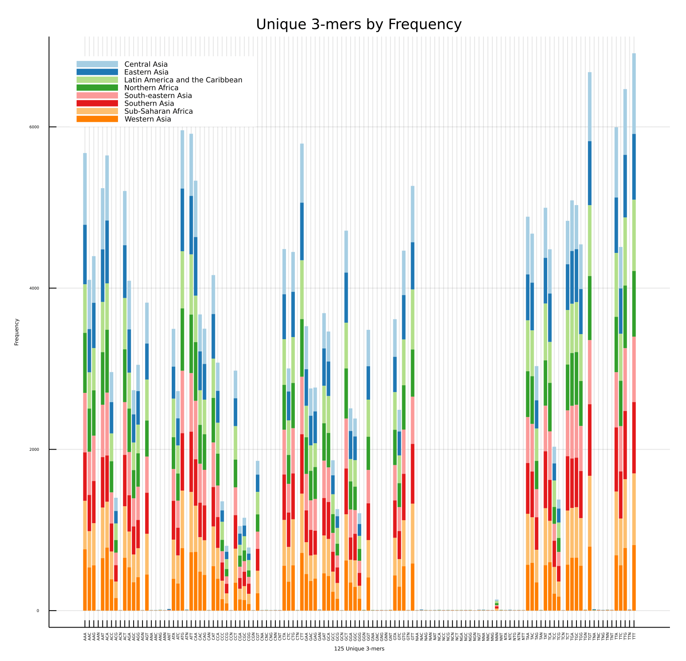
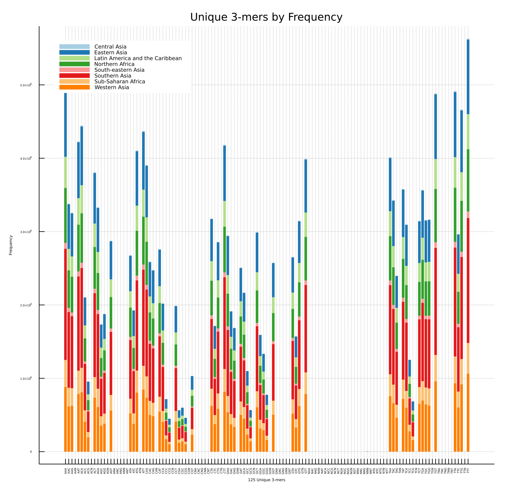
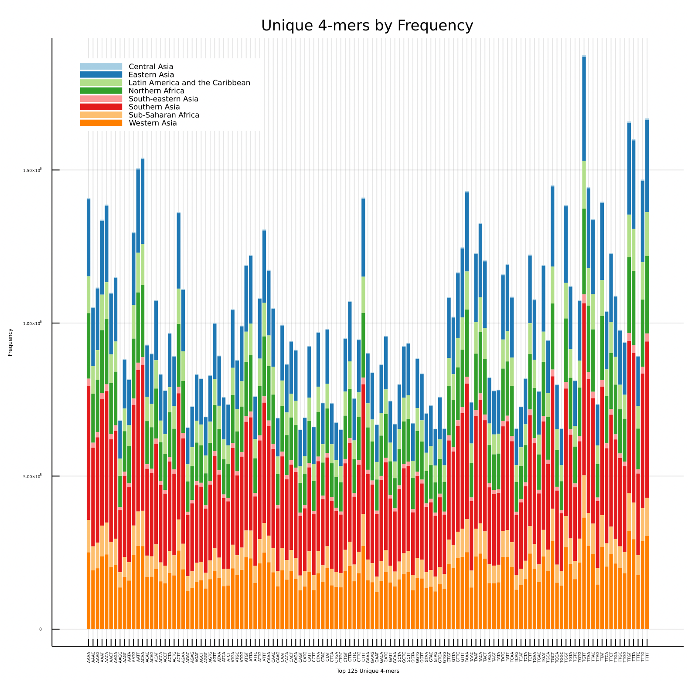
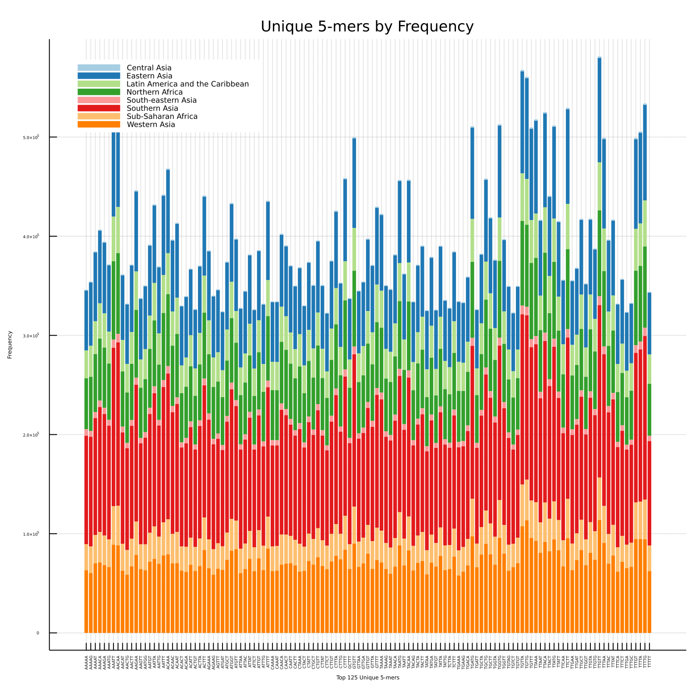
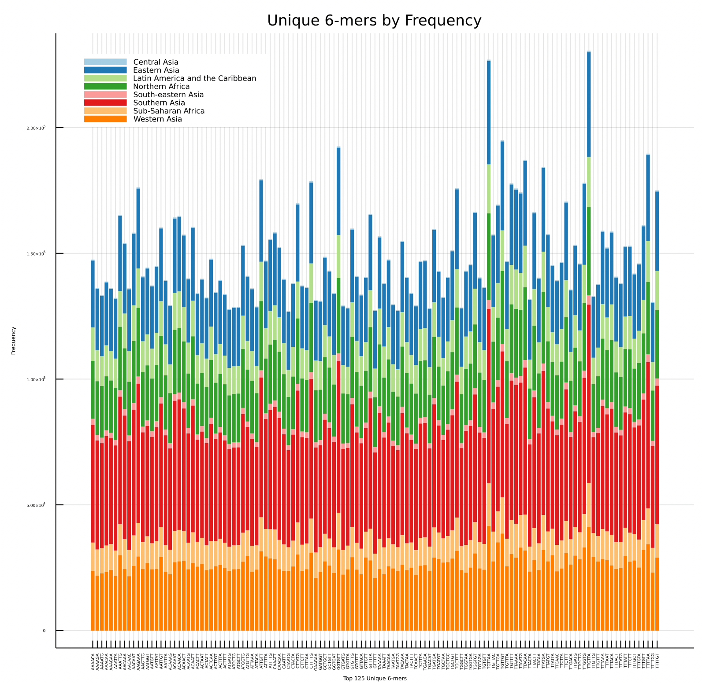

# Kmer Analysis
In this notebook, we will be analyzing the genomes found in *.../data/selectedSARSgenomes.fasta* through the lens of kmers across geograpghical region.

Let's start by parsing through the fasta file to retrieve the sequence data!

```julia
julia> using BioinformaticsBISC195

julia> genomeData = parse_fasta("../data/selectedSARSgenomes.fasta")
```

For my own convenience and the sanctity of my laptop, let's write all this data into files!

```julia
julia> using JLD2, FileIO

julia> save("../data/genomeData.jld2", Dict("headerVec" => genomeData[1], "sequenceVec" => genomeData[2]))
julia> headerVec = load("../data/genomeData.jld2", "headerVec")
5774-element Vector{Any}:
 "NC_045512.2 |Severe acute respiratory syndrome-related coronavirus||China|2019-12"
 "MZ573077.1 |Severe acute respiratory syndrome-related coronavirus||Bahrain|2021-07-05"
 "MZ573079.1 |Severe acute respiratory syndrome-related coronavirus||Bahrain|2021-07-05"
 "MZ573080.1 |Severe acute respiratory syndrome-related coronavirus||Bahrain|2021-07-05"
 "MZ572200.1 |Severe acute respiratory syndrome-related coronavirus||India|2021-06-01"
 "MZ572201.1 |Severe acute respiratory syndrome-related coronavirus||India|2021-06-01"
 "MZ572203.1 |Severe acute respiratory syndrome-related coronavirus||India|2021-06-01"
 "MZ572204.1 |Severe acute respiratory syndrome-related coronavirus||India|2021-06-04"
 "MZ572206.1 |Severe acute respiratory syndrome-related coronavirus||India|2021-06-09"
 "MZ572207.1 |Severe acute respiratory syndrome-related coronavirus||India|2021-06-14"
 "MZ571142.1 |Severe acute respiratory syndrome-related coronavirus|oronasopharynx|Morocco|2021-04-22"
 "MZ562707.1 |Severe acute respiratory syndrome-related coronavirus|oronasopharynx|Pakistan|2021-04-30"
 "MZ562746.1 |Severe acute respiratory syndrome-related coronavirus||India: Madhya Pradesh|2021-03-07"
 "MZ562747.1 |Severe acute respiratory syndrome-related coronavirus||India: Madhya Pradesh|2021-03-07"
 "MZ562748.1 |Severe acute respiratory syndrome-related coronavirus||India: Madhya Pradesh|2021-03-08"
 "MZ562749.1 |Severe acute respiratory syndrome-related coronavirus||India: Madhya Pradesh|2021-03-08"
 "MZ562750.1 |Severe acute respiratory syndrome-related coronavirus||India: Madhya Pradesh|2021-03-08"
 "MZ562751.1 |Severe acute respiratory syndrome-related coronavirus||India: Madhya Pradesh|2021-03-07"
 "MZ562752.1 |Severe acute respiratory syndrome-related coronavirus||India: Madhya Pradesh|2021-02-08"
 "MZ562753.1 |Severe acute respiratory syndrome-related coronavirus||India: Madhya Pradesh|2021-02-08"
 ⋮
 "AY502925.1 |Severe acute respiratory syndrome-related coronavirus||Taiwan|"
 "AY502926.1 |Severe acute respiratory syndrome-related coronavirus||Taiwan|"
 "AY502927.1 |Severe acute respiratory syndrome-related coronavirus||Taiwan|"
 "AY502928.1 |Severe acute respiratory syndrome-related coronavirus||Taiwan|"
 "AY502929.1 |Severe acute respiratory syndrome-related coronavirus||Taiwan|"
 "AY502930.1 |Severe acute respiratory syndrome-related coronavirus||Taiwan|"
 "AY502931.1 |Severe acute respiratory syndrome-related coronavirus||Taiwan|"
 "AY502932.1 |Severe acute respiratory syndrome-related coronavirus||Taiwan|"
 "AY313906.1 |Severe acute respiratory syndrome-related coronavirus||China: Jiangmen, Guangdong|"
 "AY304486.1 |Severe acute respiratory syndrome-related coronavirus||Hong Kong|"
 "AY304488.1 |Severe acute respiratory syndrome-related coronavirus||Hong Kong|"
 "AY304495.1 |Severe acute respiratory syndrome-related coronavirus||Hong Kong|"
 "AY348314.1 |Severe acute respiratory syndrome-related coronavirus||Taiwan|"
 "AY291451.1 |Severe acute respiratory syndrome-related coronavirus||Taiwan|"
 "AY283794.1 |Severe acute respiratory syndrome-related coronavirus||Singapore|"
 "AY283795.1 |Severe acute respiratory syndrome-related coronavirus||Singapore|"
 "AY283796.1 |Severe acute respiratory syndrome-related coronavirus||Singapore|"
 "AY283797.1 |Severe acute respiratory syndrome-related coronavirus||Singapore|"
 "AY283798.2 |Severe acute respiratory syndrome-related coronavirus||Singapore|"
 "AY278554.2 |Severe acute respiratory syndrome-related coronavirus||China: Hong Kong, Prince of Wales Hospital|"

julia> sequenceVec = load("../data/genomeData.jld2", "sequenceVec")
# output not shown here because it is too long and honestly not helpful to look at
```

Next, we will create a new vector that contains the corresponding kmer data to each sequence. Each vector item will be a dictionary that contains the counts of every unique kmer of length *k* that is contained within that specific sequence. Then, we will save that data in a file!

```julia
# kmers of length 3, 4, 5, 6, 7
julia> k3merVec, k4merVec, k5merVec, k6merVec, k7merVec = [], [], [], [], []
julia> for sequence in sequenceVec
    push!(k3merVec, getKmerCount(sequence, 3))
    push!(k4merVec, getKmerCount(sequence, 4))
    push!(k5merVec, getKmerCount(sequence, 5))
    push!(k6merVec, getKmerCount(sequence, 6))
    push!(k7merVec, getKmerCount(sequence, 7))
end

# save to file
julia> save("../data/kmerData.jld2", Dict("3mer" => k3merVec, "4mer" => k4merVec, "5" => k5merVec, "6mer" => k6merVec, "7mer" => k7merVec))

# load when you want
julia> k3merVec = load("../data/kmerData.jld2", "3mer")
julia> k4merVec = load("../data/kmerData.jld2", "4mer")
julia> k5merVec = load("../data/kmerData.jld2", "5")
julia> k6merVec = load("../data/kmerData.jld2", "6mer")
julia> k7merVec = load("../data/kmerData.jld2", "7mer")
```

Right now, our k#merVecs look like this:
```julia
julia> k3merVec
5686-element Vector{Any}:
 Dict{Any, Any}("TGT" => 858, "GAC" => 340, "GAA" => 535, "TTC" => 518, "ACA" => 809, "TAG" => 427, "GTA" => 469, "GTG" => 552, "CCT" => 344, "GCT" => 521…)
 Dict{Any, Any}("TGT" => 859, "GAC" => 340, "GAA" => 534, "TTC" => 516, "ACA" => 810, "TAG" => 426, "GTA" => 470, "GTG" => 552, "CCT" => 343, "GCT" => 521…)
 Dict{Any, Any}("TGT" => 859, "GAC" => 340, "GAA" => 535, "TTC" => 518, "ACA" => 807, "TAG" => 426, "GTA" => 469, "GTG" => 553, "CCT" => 342, "GCT" => 520…)
 Dict{Any, Any}("TGT" => 859, "GAC" => 340, "GAA" => 535, "TTC" => 516, "ACA" => 810, "TAG" => 426, "GTA" => 469, "GTG" => 553, "CCT" => 343, "GCT" => 520…)
 Dict{Any, Any}("TGT" => 859, "GAC" => 340, "GAA" => 535, "TTC" => 516, "ACA" => 808, "TAG" => 426, "GTA" => 469, "GTG" => 553, "CCT" => 343, "GCT" => 521…)
 Dict{Any, Any}("TGT" => 859, "GAC" => 340, "GAA" => 533, "TTC" => 517, "ACA" => 808, "TAG" => 427, "GTA" => 469, "GTG" => 553, "CCT" => 343, "GCT" => 520…)
 Dict{Any, Any}("TGT" => 857, "GAC" => 338, "GAA" => 534, "TTC" => 513, "ACA" => 804, "TAG" => 428, "GTA" => 468, "GTG" => 552, "GCT" => 519, "CCT" => 344…)
 Dict{Any, Any}("TGT" => 857, "GAC" => 338, "GAA" => 534, "TTC" => 513, "ACA" => 804, "TAG" => 428, "GTA" => 468, "GTG" => 552, "GCT" => 519, "CCT" => 344…)
 Dict{Any, Any}("TGT" => 857, "GAC" => 338, "GAA" => 534, "TTC" => 513, "ACA" => 804, "TAG" => 428, "GTA" => 468, "GTG" => 552, "GCT" => 519, "CCT" => 344…)
 Dict{Any, Any}("TGT" => 857, "GAC" => 338, "GAA" => 534, "TTC" => 513, "ACA" => 804, "TAG" => 428, "GTA" => 468, "GTG" => 552, "GCT" => 519, "CCT" => 344…)
 Dict{Any, Any}("TGT" => 857, "GAC" => 338, "GAA" => 534, "TTC" => 513, "ACA" => 804, "TAG" => 428, "GTA" => 468, "GTG" => 552, "GCT" => 519, "CCT" => 344…)
 Dict{Any, Any}("TGT" => 857, "GAC" => 338, "GAA" => 534, "TTC" => 513, "ACA" => 804, "TAG" => 428, "GTA" => 468, "GTG" => 552, "GCT" => 519, "CCT" => 344…)
 Dict{Any, Any}("TGT" => 857, "GAC" => 338, "GAA" => 534, "TTC" => 513, "ACA" => 804, "TAG" => 428, "GTA" => 468, "GTG" => 552, "GCT" => 519, "CCT" => 344…)
 Dict{Any, Any}("TGT" => 857, "GAC" => 338, "GAA" => 534, "TTC" => 513, "ACA" => 804, "TAG" => 428, "GTA" => 468, "GTG" => 552, "GCT" => 519, "CCT" => 344…)
 Dict{Any, Any}("TGT" => 858, "GAC" => 339, "GAA" => 533, "TTC" => 512, "ACA" => 806, "TAG" => 423, "GTA" => 465, "GTG" => 553, "GCT" => 520, "CCT" => 342…)
 Dict{Any, Any}("TGT" => 856, "GAC" => 338, "GAA" => 534, "TTC" => 510, "ACA" => 804, "TAG" => 423, "GTA" => 467, "GTG" => 554, "GCT" => 520, "CCT" => 343…)
 Dict{Any, Any}("TGT" => 855, "GAC" => 340, "GAA" => 534, "TTC" => 509, "ACA" => 806, "TAG" => 422, "GTA" => 466, "GTG" => 553, "GCT" => 518, "CCT" => 342…)
 Dict{Any, Any}("TGT" => 856, "GAC" => 338, "GAA" => 534, "TTC" => 510, "ACA" => 805, "TAG" => 423, "GTA" => 467, "GTG" => 554, "GCT" => 520, "CCT" => 343…)
 Dict{Any, Any}("TGT" => 856, "GAC" => 338, "GAA" => 534, "TTC" => 510, "ACA" => 804, "TAG" => 423, "GTA" => 467, "GTG" => 554, "GCT" => 520, "CCT" => 343…)
 Dict{Any, Any}("TGT" => 856, "GAC" => 338, "GAA" => 534, "TTC" => 510, "ACA" => 804, "TAG" => 423, "GTA" => 467, "GTG" => 554, "GCT" => 520, "CCT" => 343…)
 ⋮
 Dict{Any, Any}("TGT" => 795, "GAC" => 367, "GAA" => 454, "TTC" => 563, "ACA" => 780, "TAG" => 351, "GTA" => 438, "GTG" => 550, "CCT" => 346, "GCT" => 622…)
 Dict{Any, Any}("TGT" => 795, "GAC" => 366, "GAA" => 454, "TTC" => 563, "ACA" => 780, "TAG" => 351, "TCN" => 1, "GTA" => 438, "NGC" => 1, "GTG" => 550…)
 Dict{Any, Any}("TGT" => 795, "GAC" => 366, "GAA" => 454, "TTC" => 563, "ACA" => 780, "TAG" => 351, "GTA" => 438, "GTG" => 550, "CCT" => 346, "GCT" => 621…)
 Dict{Any, Any}("TGT" => 795, "GAC" => 367, "GAA" => 454, "TTC" => 562, "ACA" => 780, "TAG" => 351, "GTA" => 438, "GTG" => 550, "CCT" => 346, "GCT" => 622…)
 Dict{Any, Any}("TGT" => 794, "GAC" => 367, "GAA" => 454, "TTC" => 562, "ACA" => 780, "TAG" => 351, "GTA" => 438, "GTG" => 550, "CCT" => 346, "GCT" => 622…)
 Dict{Any, Any}("TGT" => 795, "GAC" => 367, "GAA" => 454, "TTC" => 562, "ACA" => 780, "TAG" => 351, "GTA" => 438, "GTG" => 551, "CCT" => 346, "GCT" => 622…)
 Dict{Any, Any}("TGT" => 794, "GAC" => 367, "GAA" => 454, "TTC" => 562, "ACA" => 780, "TAG" => 351, "TCN" => 1, "GTA" => 438, "GTG" => 550, "CCT" => 345…)
 Dict{Any, Any}("TGT" => 794, "GAC" => 367, "GAA" => 454, "TTC" => 562, "ACA" => 780, "TAG" => 351, "GTA" => 438, "GTG" => 550, "CCT" => 346, "GCT" => 622…)
 Dict{Any, Any}("TGT" => 795, "GAC" => 368, "GAA" => 454, "TTC" => 560, "ACA" => 780, "TAG" => 351, "GTA" => 440, "GTG" => 551, "CCT" => 346, "GCT" => 622…)
 Dict{Any, Any}("TGT" => 789, "GAC" => 366, "GAA" => 461, "TTC" => 563, "ACA" => 777, "TAG" => 350, "GTA" => 436, "GTG" => 549, "CCT" => 349, "GCT" => 622…)
 Dict{Any, Any}("TGT" => 789, "GAC" => 365, "GAA" => 459, "TTC" => 563, "ACA" => 775, "TAG" => 349, "GTA" => 436, "GTG" => 549, "CCT" => 349, "GCT" => 622…)
 Dict{Any, Any}("TGT" => 795, "GAC" => 367, "GAA" => 455, "TTC" => 563, "ACA" => 781, "TAG" => 351, "GTA" => 438, "GTG" => 550, "CCT" => 345, "GCT" => 622…)
 Dict{Any, Any}("TGT" => 789, "GAC" => 366, "GAA" => 449, "TTC" => 560, "ACA" => 779, "TAG" => 345, "GTA" => 435, "GTG" => 547, "GCT" => 621, "CCT" => 342…)
 Dict{Any, Any}("TGT" => 795, "GAC" => 367, "GAA" => 454, "TTC" => 563, "ACA" => 780, "TAG" => 351, "GTA" => 438, "GTG" => 550, "CCT" => 346, "GCT" => 622…)
 Dict{Any, Any}("TGT" => 795, "GAC" => 367, "GAA" => 455, "TTC" => 563, "ACA" => 778, "TAG" => 350, "GTA" => 438, "GTG" => 550, "CCT" => 345, "GCT" => 622…)
 Dict{Any, Any}("TGT" => 795, "GAC" => 367, "GAA" => 453, "TTC" => 562, "ACA" => 778, "TAG" => 350, "GTA" => 438, "GTG" => 551, "CCT" => 345, "GCT" => 623…)
 Dict{Any, Any}("TGT" => 796, "GAC" => 367, "GAA" => 454, "TTC" => 563, "ACA" => 780, "TAG" => 350, "GTA" => 438, "GTG" => 550, "CCT" => 344, "GCT" => 622…)
 Dict{Any, Any}("TGT" => 795, "GAC" => 367, "NAA" => 1, "GAA" => 453, "TTC" => 562, "ACA" => 778, "TAG" => 350, "GTA" => 438, "GTG" => 550, "CCT" => 345…)
 Dict{Any, Any}("TGT" => 795, "GAC" => 367, "GAA" => 454, "TTC" => 563, "ACA" => 778, "TAG" => 351, "GTA" => 438, "GTG" => 550, "CCT" => 345, "GCT" => 622…)
 Dict{Any, Any}("TGT" => 794, "GAC" => 368, "GAA" => 454, "TTC" => 563, "ACA" => 781, "TAG" => 350, "GTA" => 437, "GTG" => 550, "CCT" => 346, "GCT" => 622…)
```

Since we have all the data readily available now, let's build a table to organize it! We probably want something like this:
|Unique Kmer|*k* Length|Count|Accession|Location|
|------|------|------|------|------|
|kmer 1|length 1|count 1|id 1|location 1|
|kmer 2|length 2|count 2|id 2|location 2|
|kmer 3|length 3|count 3|id 3|location 3|

We'll use DataFrames.jl to do this! The easiest way to set up a dataframe is to pass a vector for each column, so first, we have to build our vectors.

```julia
julia> kmer, k, count, id, location = [], [], [], [], []
julia> for num in 3:6
    num == 3 && (kmerVec = k3merVec)
    num == 4 && (kmerVec = k4merVec)
    num == 5 && (kmerVec = k5merVec)
    num == 6 && (kmerVec = k6merVec)
    for index in 1:length(sequenceVec)
        for kmerKey in keys(kmerVec[index])
            push!(kmer, kmerKey)
            push!(k, num)
            push!(count, kmerVec[index][kmerKey])
            headerInfo = getHeaderAttrib(headerVec[index], "|", [1,4])
            push!(id, headerInfo[1])
            push!(location, headerInfo[2])
        end
    end
end

julia> save("../data/kmerDf.jld2", Dict("kmer" => kmer, "k" => k, "count" => count, "id" => id, "location" => location)) # in case we want to skip all the previous steps

# load!
julia> kmer = load("../data/kmerDf.jld2", "kmer")
julia> k = load("../data/kmerDf.jld2", "k")
julia> count = load("../data/kmerDf.jld2", "count")
julia> id = load("../data/kmerDf.jld2", "id")
julia> location = load("../data/kmerDf.jld2", "location")
```

Now we have our vectors! You might have noticed that I excluded the 7-mers; that's because my laptop was struggling! So I gave up on that dream. Moving on, let's set up our dataframe and see what it looks like. So exciting!!

```julia
julia> using DataFrames

julia> kmerDf = DataFrame(kmer = kmer, k = k, count = count, id = id, location = location)

julia> kmerDf
29619676×5 DataFrame
      Row │ kmer    k    count  id           location                          
          │ Any     Any  Any    Any          Any                               
──────────┼────────────────────────────────────────────────────────────────────
        1 │ TGT     3    858    NC_045512.2  China
        2 │ GAC     3    340    NC_045512.2  China
        3 │ GAA     3    535    NC_045512.2  China
        4 │ TTC     3    518    NC_045512.2  China
        5 │ ACA     3    809    NC_045512.2  China
        6 │ TAG     3    427    NC_045512.2  China
        7 │ GTA     3    469    NC_045512.2  China
        8 │ GTG     3    552    NC_045512.2  China
        9 │ CCT     3    344    NC_045512.2  China
       10 │ GCT     3    521    NC_045512.2  China
       11 │ GGC     3    223    NC_045512.2  China
       12 │ AGG     3    329    NC_045512.2  China
       13 │ CGG     3    76     NC_045512.2  China
       14 │ AGC     3    301    NC_045512.2  China
       15 │ ATT     3    773    NC_045512.2  China
       16 │ GAT     3    440    NC_045512.2  China
       17 │ CAG     3    438    NC_045512.2  China
       18 │ ATG     3    725    NC_045512.2  China
    ⋮     │   ⋮      ⋮     ⋮         ⋮                       ⋮
 29619659 │ TCAAGT  6    8      AY278554.2   China: Hong Kong, Prince of Wale…
 29619660 │ GAACAG  6    7      AY278554.2   China: Hong Kong, Prince of Wale…
 29619661 │ TACTGT  6    14     AY278554.2   China: Hong Kong, Prince of Wale…
 29619662 │ ATATTA  6    7      AY278554.2   China: Hong Kong, Prince of Wale…
 29619663 │ GCTACA  6    18     AY278554.2   China: Hong Kong, Prince of Wale…
 29619664 │ GCCAAT  6    6      AY278554.2   China: Hong Kong, Prince of Wale…
 29619665 │ GGATCA  6    3      AY278554.2   China: Hong Kong, Prince of Wale…
 29619666 │ CCCAGC  6    3      AY278554.2   China: Hong Kong, Prince of Wale…
 29619667 │ TTTAGT  6    13     AY278554.2   China: Hong Kong, Prince of Wale…
 29619668 │ CTGCGA  6    1      AY278554.2   China: Hong Kong, Prince of Wale…
 29619669 │ TCGTGC  6    6      AY278554.2   China: Hong Kong, Prince of Wale…
 29619670 │ TTAACG  6    3      AY278554.2   China: Hong Kong, Prince of Wale…
 29619671 │ ATTGTA  6    12     AY278554.2   China: Hong Kong, Prince of Wale…
 29619672 │ AAGTCG  6    2      AY278554.2   China: Hong Kong, Prince of Wale…
 29619673 │ TAAATC  6    5      AY278554.2   China: Hong Kong, Prince of Wale…
 29619674 │ GCTTGT  6    18     AY278554.2   China: Hong Kong, Prince of Wale…
 29619675 │ TTGTCC  6    5      AY278554.2   China: Hong Kong, Prince of Wale…
 29619676 │ CAGGTT  6    14     AY278554.2   China: Hong Kong, Prince of Wale…
                                                          29619640 rows omitted
```

As you can tell, the location column is taken straight from the header so it's not consistent. Some of them contain city names while some only contain country names. There also seems to be a lot slightly different ones, which would make it very difficult to plot the data as it is now. Let's take a look at all the unique locations by turning the vector into a set.

```julia
julia> uniqueLocations = Set(kmerDf.location)
Set{Any} with 240 elements:
  "Uruguay"
  "India: Dahod"
  "China: Anhui, Fuyang"
  "Philippines: NCR, Cavite City"
  "India: Junagadh"
  "Brazil: Amazonas, Manaus"
  "India: Khambhaliya"
  "India: Delhi"
  "India: Dhandhuka"
  "India: Jamnagar"
  "India: Gujarat, Mehsana"
  "India: Gujarat, Kodinar"
  "Bangladesh: Khulna"
  "India: Gujarat, Sutrapada"
  "Colombia: Antioquia"
  "Thailand"
  "Cambodia"
  "Philippines: Caloocan City"
  "India: Vadodara"
  "Japan: Osaka"
  "India: Dhansura"
  "India: Kadi"
  "Chile"
  "Pakistan: Gilgit Baltistan"
  "India: Bhuj"
  "Saudi Arabia: Jeddah"
  "Thailand: Bangkok"
  "Iraq"
  "India: Savli"
  "India: Botad"
  "Argentina"
  "China: Southern China"
  "India: Kapadvanj"
  "Tunisia: Bizerte"
  "India: Gondal"
  "Jordan: Amman"
  "Colombia"
  "Togo"
  "India: Anand"
  "Japan: Kanagawa, Sagamihara"
  ⋮ 
```

Now that we have an idea of what the locations are, and how they are formatted (country name before first colon, if any), let's add a new column to generalize by country. Of course, since we are automating this process, we are reproducing how the NCBI has labeled the data, even though there may be errors or we might not agree. Because of this, our analysis might miss some of the important nuances to the data.

```julia
julia> kmerDf.country = map(x -> split(x, ":")[1], kmerDf.location)

julia> uniqueCountries = Set(kmerDf.country) # see set of unique countries
Set{SubString{String}} with 60 elements:
  "Uruguay"
  "Thailand"
  "Cambodia"
  "Chile"
  "Iraq"
  "Argentina"
  "Colombia"
  "Togo"
  "Zambia"
  "India"
  "South Korea"
  "Malaysia"
  "Iran"
  "United Arab Emirates"
  "Israel"
  "Turkey"
  "Ethiopia"
  "Sierra Leone"
  "Venezuela"
  "Brazil"
  "Uzbekistan"
  "Ghana"
  "China"
  "Somalia"
  "Uganda"
  "Libya"
  "Qatar"
  "Egypt"
  "Tunisia"
  "Jordan"
  "Mali"
  "Pakistan"
  "Gambia"
  "Philippines"
  "Oman"
  "Kenya"
  "Singapore"
  "Peru"
  "Myanmar"
  "Ecuador"
  ⋮ 
```

We have narrowed down from 240 locations to 60 countries! That's great, but perhaps we should narrow it down a bit more... I found a JSON file *countries.json* populated with country data that was created by a GitHub user named lukes. From that mapping, I'll make a new JSON that fits my needs more closely.

```julia
julia> using JSON

# read from lukes JSON
julia> countryInfo = Dict()
julia> open("../data/countries.json", "r") do f
    global countryInfo
    info = read(f, String)
    countryInfo = JSON.parse(info)
end

# make my own dicts with just country, region, and sub-region info
julia> country_to_region = Dict()
julia> country_to_subregion = Dict()
julia> for country in countryInfo
    country_to_region[country["name"]] = country["region"]
    country_to_subregion[country["name"]] = country["sub-region"]
end

# DONT RUN THIS -- IT WILL NOT WORK ANYMOREEE, this writes to file but I also edited manually
julia> open("../data/country_to_region.json", "w") do f
        write(f, JSON.json(country_to_region))
end
julia> open("../data/country_to_subregion.json", "w") do f
        write(f, JSON.json(country_to_subregion))
end
```

The dictionary is obviously not perfect and does not perfectly match some of the country names used. I made edits manually work for my set of sequence data. Of course, feel free to edit as you need for your set of data.

```julia
# just run this to load
julia> country_to_region = Dict()
julia> country_to_subregion = Dict()

julia> open("../data/country_to_region.json", "r") do f
    global country_to_region
    info = read(f, String)
    country_to_region = JSON.parse(info)
end
julia> open("../data/country_to_subregion.json", "r") do f
    global country_to_subregion
    info = read(f, String)
    country_to_subregion = JSON.parse(info)
end
```

We've narrowed down the geographical categories by a lot! Here are the unique regions and sub-regions that came out of our data!

```julia
julia> Set(map(x -> country_to_region[x], collect(uniqueCountries)))
Set{Any} with 3 elements:
  "Africa"
  "Asia"
  "Americas"

julia> Set(map(x -> country_to_subregion[x], collect(uniqueCountries)))
Set{Any} with 8 elements:
  "Sub-Saharan Africa"
  "Northern Africa"
  "South-eastern Asia"
  "Latin America and the Caribbean"
  "Southern Asia"
  "Western Asia"
  "Central Asia"
  "Eastern Asia"
```

Now, let's add just one more column to the dataframe to organize the data by region and subregion. Also, it'd be nice if the types were more specific.

```julia
julia> kmerDf.region = map(x -> country_to_region[x], kmerDf.country)
julia> kmerDf.subregion = map(x -> country_to_subregion[x], kmerDf.country)

julia> kmerDf[!, :kmer] = convert.(String, kmerDf[:, :kmer])
julia> kmerDf[!, :k] = convert.(Int, kmerDf[:, :k])
julia> kmerDf[!, :count] = convert.(Int, kmerDf[:, :count])
julia> kmerDf[!, :id] = convert.(String, kmerDf[:, :id])
julia> kmerDf[!, :location] = convert.(String, kmerDf[:, :location])
julia> kmerDf[!, :country] = convert.(String, kmerDf[:, :country])
julia> kmerDf
29619676×8 DataFrame
      Row │ kmer    k    count  id           location           country    region  subregion    
          │ String     Int64  Int64    Any          Any                String  String  String       
──────────┼───────────────────────────────────────────────────────────────────────────────────────
        1 │ TGT     3    858    NC_045512.2  China              China      Asia    Eastern Asia
        2 │ GAC     3    340    NC_045512.2  China              China      Asia    Eastern Asia
        3 │ GAA     3    535    NC_045512.2  China              China      Asia    Eastern Asia
        4 │ TTC     3    518    NC_045512.2  China              China      Asia    Eastern Asia
        5 │ ACA     3    809    NC_045512.2  China              China      Asia    Eastern Asia
        6 │ TAG     3    427    NC_045512.2  China              China      Asia    Eastern Asia
        7 │ GTA     3    469    NC_045512.2  China              China      Asia    Eastern Asia
        8 │ GTG     3    552    NC_045512.2  China              China      Asia    Eastern Asia
        9 │ CCT     3    344    NC_045512.2  China              China      Asia    Eastern Asia
       10 │ GCT     3    521    NC_045512.2  China              China      Asia    Eastern Asia
       11 │ GGC     3    223    NC_045512.2  China              China      Asia    Eastern Asia
       12 │ AGG     3    329    NC_045512.2  China              China      Asia    Eastern Asia
       13 │ CGG     3    76     NC_045512.2  China              China      Asia    Eastern Asia
       14 │ AGC     3    301    NC_045512.2  China              China      Asia    Eastern Asia
       15 │ ATT     3    773    NC_045512.2  China              China      Asia    Eastern Asia
       16 │ GAT     3    440    NC_045512.2  China              China      Asia    Eastern Asia
       17 │ CAG     3    438    NC_045512.2  China              China      Asia    Eastern Asia
       18 │ ATG     3    725    NC_045512.2  China              China      Asia    Eastern Asia
    ⋮     │   ⋮      ⋮     ⋮         ⋮               ⋮               ⋮         ⋮          ⋮
 29619659 │ TCAAGT  6    8      AY278554.2   China: Hong Kong…  China      Asia    Eastern Asia
 29619660 │ GAACAG  6    7      AY278554.2   China: Hong Kong…  China      Asia    Eastern Asia
 29619661 │ TACTGT  6    14     AY278554.2   China: Hong Kong…  China      Asia    Eastern Asia
 29619662 │ ATATTA  6    7      AY278554.2   China: Hong Kong…  China      Asia    Eastern Asia
 29619663 │ GCTACA  6    18     AY278554.2   China: Hong Kong…  China      Asia    Eastern Asia
 29619664 │ GCCAAT  6    6      AY278554.2   China: Hong Kong…  China      Asia    Eastern Asia
 29619665 │ GGATCA  6    3      AY278554.2   China: Hong Kong…  China      Asia    Eastern Asia
 29619666 │ CCCAGC  6    3      AY278554.2   China: Hong Kong…  China      Asia    Eastern Asia
 29619667 │ TTTAGT  6    13     AY278554.2   China: Hong Kong…  China      Asia    Eastern Asia
 29619668 │ CTGCGA  6    1      AY278554.2   China: Hong Kong…  China      Asia    Eastern Asia
 29619669 │ TCGTGC  6    6      AY278554.2   China: Hong Kong…  China      Asia    Eastern Asia
 29619670 │ TTAACG  6    3      AY278554.2   China: Hong Kong…  China      Asia    Eastern Asia
 29619671 │ ATTGTA  6    12     AY278554.2   China: Hong Kong…  China      Asia    Eastern Asia
 29619672 │ AAGTCG  6    2      AY278554.2   China: Hong Kong…  China      Asia    Eastern Asia
 29619673 │ TAAATC  6    5      AY278554.2   China: Hong Kong…  China      Asia    Eastern Asia
 29619674 │ GCTTGT  6    18     AY278554.2   China: Hong Kong…  China      Asia    Eastern Asia
 29619675 │ TTGTCC  6    5      AY278554.2   China: Hong Kong…  China      Asia    Eastern Asia
 29619676 │ CAGGTT  6    14     AY278554.2   China: Hong Kong…  China      Asia    Eastern Asia
                                                                            29619640 rows omitted
```

The biggest issue now is that we have multiple entries for the same kmer, since we added each kmer for each sequence into the dataframe. Since we have so much data, it might be good to make separate DataFrames for each kmer length so that plotting is each one is easier later.

```julia
julia> k3merDf = kmerDf[kmerDf[:, :k] .== 3, :]
julia> k4merDf = kmerDf[kmerDf[:, :k] .== 4, :]
julia> k5merDf = kmerDf[kmerDf[:, :k] .== 5, :]
julia> k6merDf = kmerDf[kmerDf[:, :k] .== 6, :]
```

Wow, we have a lot of data! Let's try plotting just the 3-mers first and see how it turns out!

```julia
julia> using StatsPlots
julia> using Measures

julia> groupedbar(k3merDf.kmer,
           k3merDf.count, 
           bar_position = :stack, 
           group = k3merDf.subregion,
           xlabel = "125 Unique 3-mers", 
           ylabel = "Frequency", 
           title = "Unique 3-mers by Frequency", 
           titlefontsize = 30,
           legendfontsize = 15,
           xrotation = 90, 
           color_palette = palette(:Paired_8), 
           linecolor = nothing, 
           legend = :topleft, 
           foreground_color_legend = nothing, 
           size = (2100, 2000), 
           left_margin = 20mm, bottom_margin = 10mm)
```


Our plot looks a little off though? Our plot only just passes a frequency of 6000 but the sum of the counts for 3-mer "TTT" gives us this:

```julia
julia> sum(k3merDf[k3merDf[:, :kmer] .== "TTT", :].count)
5631314
```

This bug may be due to the fact that we are grouping sub-region instead of accession number, so function might just be plotting the first count for each sub-region, instead of adding up all of them. To get around this, let's reorganize our data.

```julia
julia> k3merSumDf = combine(groupby(k3merDf, [:kmer, :subregion]), [:count] .=> sum)
971×3 DataFrame
 Row │ kmer    subregion                        count_sum 
     │ String  String                           Int64     
─────┼────────────────────────────────────────────────────
   1 │ TGT     Eastern Asia                        882873
   2 │ GAC     Eastern Asia                        345807
   3 │ GAA     Eastern Asia                        531842
   4 │ TTC     Eastern Asia                        536085
   5 │ ACA     Eastern Asia                        801236
   6 │ TAG     Eastern Asia                        433839
   7 │ GTA     Eastern Asia                        479550
   8 │ GTG     Eastern Asia                        569047
   9 │ CCT     Eastern Asia                        359748
  10 │ GCT     Eastern Asia                        540446
  11 │ GGC     Eastern Asia                        241598
  12 │ AGG     Eastern Asia                        338883
  13 │ CGG     Eastern Asia                         83761
  14 │ AGC     Eastern Asia                        313799
  ⋮  │   ⋮                    ⋮                     ⋮
 958 │ NAN     Eastern Asia                             3
 959 │ NAN     Western Asia                             7
 960 │ NGN     Western Asia                             2
 961 │ NCG     Eastern Asia                             4
 962 │ GNN     South-eastern Asia                       3
 963 │ AGN     South-eastern Asia                       2
 964 │ NNC     South-eastern Asia                       3
 965 │ NCA     South-eastern Asia                       3
 966 │ GGN     South-eastern Asia                       1
 967 │ CNN     South-eastern Asia                       1
 968 │ CCN     South-eastern Asia                       1
 969 │ NTT     South-eastern Asia                       1
 970 │ NAN     Southern Asia                           12
 971 │ NCN     Western Asia                             2
                                          943 rows omitted

julia> k3merSumDf[k3merSumDf[:, :kmer] .== "TTT", :]
8×3 DataFrame
 Row │ kmer    subregion                        count_sum 
     │ String  String                           Int64     
─────┼────────────────────────────────────────────────────
   1 │ TTT     Eastern Asia                       1017305
   2 │ TTT     Western Asia                       1062631
   3 │ TTT     Southern Asia                      1704991
   4 │ TTT     Northern Africa                     848367
   5 │ TTT     Latin America and the Caribbean     477133
   6 │ TTT     Sub-Saharan Africa                  417755
   7 │ TTT     South-eastern Asia                   88062
   8 │ TTT     Central Asia                         15070

julia> sum(k3merSumDf[k3merSumDf[:, :kmer] .== "TTT", :].count_sum)
5631314

julia> groupedbar(k3merSumDf.kmer,
           k3merSumDf.count_sum, 
           bar_position = :stack, 
           group = k3merSumDf.subregion,
           xlabel = "125 Unique 3-mers", 
           ylabel = "Frequency", 
           title = "Unique 3-mers by Frequency", 
           titlefontsize = 30,
           legendfontsize = 15,
           xrotation = 90, 
           color_palette = palette(:Paired_8), 
           linecolor = nothing, 
           legend = :topleft, 
           foreground_color_legend = nothing, 
           size = (2100, 2000), 
           left_margin = 20mm, bottom_margin = 10mm)
```


Perfect! That's exactly what we want! Let's do it with the rest now!

```julia
julia> k4merSumDf = combine(groupby(k4merDf, [:kmer, :subregion]), [:count] .=> sum)
4161×3 DataFrame
  Row │ kmer    subregion     count_sum 
      │ String  String        Int64     
──────┼─────────────────────────────────
    1 │ TTAG    Eastern Asia     133093
    2 │ TAAT    Eastern Asia     222398
    3 │ GGAA    Eastern Asia      99543
    4 │ CTTG    Eastern Asia     170807
    5 │ CCCC    Eastern Asia      17475
    6 │ GGGC    Eastern Asia      33286
    7 │ GTAA    Eastern Asia     127516
    8 │ CAGG    Eastern Asia      88769
    9 │ TGGG    Eastern Asia      59082
   10 │ CGAT    Eastern Asia      33299
   11 │ CACT    Eastern Asia     170066
   12 │ ACAT    Eastern Asia     194090
   13 │ TAAA    Eastern Asia     258421
   14 │ CGTG    Eastern Asia      64972
   15 │ CTAG    Eastern Asia      87811
   16 │ CTTA    Eastern Asia     193728
   17 │ GAAG    Eastern Asia     151388
   18 │ TGCG    Eastern Asia      38855
   19 │ ATTG    Eastern Asia     195326
  ⋮   │   ⋮          ⋮            ⋮
 4143 │ TCNC    Western Asia          4
 4144 │ ANCG    Western Asia          1
 4145 │ NGCC    Western Asia          1
 4146 │ GNTN    Western Asia          1
 4147 │ GGNG    Western Asia          5
 4148 │ NTCG    Western Asia          1
 4149 │ GANC    Western Asia          2
 4150 │ NCCN    Western Asia          1
 4151 │ TGNG    Western Asia          2
 4152 │ GGGN    Western Asia          1
 4153 │ TNCN    Western Asia          2
 4154 │ NGNT    Western Asia          1
 4155 │ NGGN    Western Asia          1
 4156 │ GNGN    Western Asia          1
 4157 │ GNNT    Western Asia          1
 4158 │ NCNT    Western Asia          1
 4159 │ NTGN    Western Asia          2
 4160 │ NCNC    Western Asia          1
 4161 │ GGNA    Western Asia          1
                       4123 rows omitted

julia> Set(k4merSumDf.kmer)
Set{String} with 616 elements:
  "CACT"
  "TAAA"
  "CGNC"
  ⋮ 
```
Hmm, there's a lot more unique elements than with the 3-mers. Let's just plot the top 125 counts!

```julia
julia> k4merTotals = combine(groupby(k4merDf, [:kmer]), [:count] .=> sum)
616×2 DataFrame
 Row │ kmer    count_sum 
     │ String  Int64     
─────┼───────────────────
   1 │ TTAG       735173
   2 │ TAAT      1228507
   3 │ GGAA       551919
   4 │ CTTG       946629
   5 │ CCCC        95939
   6 │ GGGC       184129
   7 │ GTAA       705665
   8 │ CAGG       491337
   9 │ TGGG       326422
  10 │ CGAT       185051
  11 │ CACT       941602
  12 │ ACAT      1075362
  13 │ TAAA      1430803
  14 │ CGTG       359165
  15 │ CTAG       486951
  16 │ CTTA      1071190
  17 │ GAAG       838458
  18 │ TGCG       214727
  19 │ ATTG      1081977
  ⋮  │   ⋮         ⋮
 598 │ TNNG            2
 599 │ GNNG            5
 600 │ NANC            2
 601 │ CNAN            4
 602 │ NCCN            2
 603 │ NANN            9
 604 │ NCAN            3
 605 │ GNAN            2
 606 │ NACN            2
 607 │ NGAN            1
 608 │ CGNN           10
 609 │ NNAN            8
 610 │ ANGN            1
 611 │ NGNA            3
 612 │ NAGN            1
 613 │ NNCG            1
 614 │ NGGN            1
 615 │ GNGN            1
 616 │ NTGN            2
         578 rows omitted

julia> sort!(k4merTotals, :count_sum, rev=true)
616×2 DataFrame
 Row │ kmer    count_sum 
     │ String  Int64     
─────┼───────────────────
   1 │ TGTT      1874638
   2 │ TTTT      1668355
   3 │ TTGT      1658519
   4 │ TTTA      1600994
   5 │ ACAA      1539938
   6 │ AATT      1505738
   7 │ TTTG      1468632
   8 │ TGCT      1449961
   9 │ TTAA      1444013
  10 │ TAAA      1430803
  11 │ CTTT      1409957
  12 │ AAAA      1408303
  13 │ TTAT      1396393
  14 │ AACA      1386966
  15 │ TGGT      1385252
  16 │ ACTT      1362294
  17 │ TTAC      1339627
  18 │ AAAT      1337517
  19 │ TACA      1326899
  ⋮  │   ⋮         ⋮
 598 │ NCNN            2
 599 │ CNNC            2
 600 │ NANG            2
 601 │ NGNT            2
 602 │ TNNG            2
 603 │ NANC            2
 604 │ NCCN            2
 605 │ GNAN            2
 606 │ NACN            2
 607 │ NTGN            2
 608 │ CNNG            1
 609 │ TNGN            1
 610 │ NNCN            1
 611 │ NGAN            1
 612 │ ANGN            1
 613 │ NAGN            1
 614 │ NNCG            1
 615 │ NGGN            1
 616 │ GNGN            1
         578 rows omitted

julia> top125k4mers = k4merTotals.kmer[1:125]
125-element Vector{String}:
 "TGTT"
 "TTTT"
 "TTGT"
 "TTTA"
 "ACAA"
 "AATT"
 "TTTG"
 "TGCT"
 "TTAA"
 "TAAA"
 "CTTT"
 "AAAA"
 "TTAT"
 "AACA"
 "TGGT"
 "ACTT"
 "TTAC"
 "AAAT"
 "TACA"
 "ATTT"
 "AATG"
 ⋮
 "ATCT"
 "GTAC"
 "AGAG"
 "TCAT"
 "GTAA"
 "AGGT"
 "CATG"
 "CAAG"
 "AAGG"
 "CTGA"
 "GGTA"
 "GCAA"
 "GAAT"
 "CCTT"
 "AGAC"
 "TCAG"
 "TGGC"
 "GTGG"
 "GTAG"
 "CTGC"
 "CAGT"

julia> top125k4mersDf = filter(row -> row.kmer ∈ top125k4mers, k4merSumDf)
1000×3 DataFrame
  Row │ kmer    subregion      count_sum 
      │ String  String         Int64     
──────┼──────────────────────────────────
    1 │ TGTT    Southern Asia     562025
    2 │ TTTT    Southern Asia     510163
    3 │ TTGT    Southern Asia     497664
    4 │ TTTA    Southern Asia     488978
    5 │ ACAA    Southern Asia     476778
    6 │ AATT    Southern Asia     462334
    7 │ TAAA    Southern Asia     442793
    8 │ TTTG    Southern Asia     439244
    9 │ AAAA    Southern Asia     437885
   10 │ TTAA    Southern Asia     437470
   11 │ TGCT    Southern Asia     432472
   12 │ AACA    Southern Asia     429251
   13 │ CTTT    Southern Asia     423913
   14 │ TTAT    Southern Asia     419683
   15 │ TGGT    Southern Asia     416443
   16 │ AAAT    Southern Asia     412712
   17 │ ACTT    Southern Asia     412511
   18 │ TTAC    Southern Asia     409764
   19 │ TACA    Southern Asia     403748
  ⋮   │   ⋮           ⋮            ⋮
  982 │ TCAT    Central Asia        1901
  983 │ CTAC    Central Asia        1899
  984 │ GTAA    Central Asia        1886
  985 │ AGGT    Central Asia        1843
  986 │ GAAT    Central Asia        1819
  987 │ GGTA    Central Asia        1801
  988 │ CAAG    Central Asia        1796
  989 │ CATG    Central Asia        1794
  990 │ AAGG    Central Asia        1785
  991 │ AGAC    Central Asia        1760
  992 │ CCTT    Central Asia        1754
  993 │ GTAG    Central Asia        1745
  994 │ CTGA    Central Asia        1745
  995 │ TCAG    Central Asia        1729
  996 │ CAGT    Central Asia        1726
  997 │ GCAA    Central Asia        1713
  998 │ GTGG    Central Asia        1705
  999 │ CTGC    Central Asia        1675
 1000 │ TGGC    Central Asia        1639
                         962 rows omitted

julia> Set(top125k4mersDf.kmer) # just checking
Set{String} with 125 elements:
  "CACT"
  "TAAA"
  "GGTA"
  "CAAT"
  "TCTA"
  ⋮ 

julia> groupedbar(top125k4mersDf.kmer,
           top125k4mersDf.count_sum, 
           bar_position = :stack, 
           group = top125k4mersDf.subregion,
           xlabel = "Top 125 Unique 4-mers", 
           ylabel = "Frequency", 
           title = "Unique 4-mers by Frequency", 
           titlefontsize = 30,
           legendfontsize = 15,
           xrotation = 90, 
           color_palette = palette(:Paired_8), 
           linecolor = nothing, 
           legend = :topleft, 
           foreground_color_legend = nothing, 
           size = (2100, 2000), 
           left_margin = 20mm, bottom_margin = 10mm)
```


4-mers all done! 5-mers next!! I'll make it a bit shorter this time.

```julia
julia> k5merSumDf = combine(groupby(k5merDf, [:kmer, :subregion]), [:count] .=> sum)
14961×3 DataFrame
   Row │ kmer    subregion     count_sum 
       │ String  String        Int64     
───────┼─────────────────────────────────
     1 │ GGACC   Eastern Asia      15607
     2 │ TGTTT   Eastern Asia      91973
     3 │ GCTGT   Eastern Asia      55565
     4 │ TCGCT   Eastern Asia       8058
     5 │ TCGTG   Eastern Asia      15531
     6 │ GGGCA   Eastern Asia      11428
     7 │ AGGAG   Eastern Asia      24790
     8 │ GGAAA   Eastern Asia      25000
     9 │ GTCCC   Eastern Asia       7492
    10 │ CTGTG   Eastern Asia      36284
    11 │ CGCGA   Eastern Asia       5193
    12 │ AACCC   Eastern Asia      16597
    13 │ ATATT   Eastern Asia      37550
    14 │ CGACC   Eastern Asia       3094
    15 │ TTGTC   Eastern Asia      49190
    16 │ CTGAG   Eastern Asia      20420
    17 │ GTTAC   Eastern Asia      56211
    18 │ AAACA   Eastern Asia      73306
    19 │ GCTAG   Eastern Asia      24918
   ⋮   │   ⋮          ⋮            ⋮
 14943 │ CCNGT   Western Asia          1
 14944 │ AGGGN   Western Asia          1
 14945 │ NAACG   Western Asia          1
 14946 │ TTGGN   Western Asia          1
 14947 │ CACTN   Western Asia          1
 14948 │ CTNAT   Western Asia          1
 14949 │ TNATG   Western Asia          1
 14950 │ NCCAT   Western Asia          1
 14951 │ GGNAC   Western Asia          1
 14952 │ TGGNA   Western Asia          1
 14953 │ AGACN   Western Asia          1
 14954 │ CNTGC   Western Asia          1
 14955 │ TCNTG   Western Asia          1
 14956 │ CTCNT   Western Asia          1
 14957 │ ATGCN   Western Asia          1
 14958 │ CNCTA   Western Asia          1
 14959 │ AAGNA   Western Asia          1
 14960 │ AAAGN   Western Asia          1
 14961 │ NAATA   Western Asia          1
                       14923 rows omitted

julia> top125k5mers = sort(combine(groupby(k5merDf, [:kmer]), [:count] .=> sum), :count_sum, rev=true).kmer[1:125]
125-element Vector{String}:
 "TTGTT"
 "TGTTA"
 "TGTTG"
 "TTTTG"
 "TTCTT"
 "AACAA"
  ⋮ 

julia> top125k5mersDf = filter(row -> row.kmer ∈ top125k5mers, k5merSumDf)
1000×3 DataFrame
  Row │ kmer    subregion     count_sum 
      │ String  String        Int64     
──────┼─────────────────────────────────
    1 │ TGTTT   Eastern Asia      91973
    2 │ AAACA   Eastern Asia      73306
    3 │ TTAAA   Eastern Asia      93565
    4 │ ATGAT   Eastern Asia      58622
    5 │ AGAAA   Eastern Asia      69596
    6 │ AAAAT   Eastern Asia      69416
    7 │ TCTTA   Eastern Asia      59161
    8 │ CAAAA   Eastern Asia      60090
    9 │ TTTAA   Eastern Asia      90181
   10 │ ACTTA   Eastern Asia      67055
   11 │ TGAAA   Eastern Asia      60283
   12 │ TTCAA   Eastern Asia      64209
   13 │ TTTTA   Eastern Asia      91354
   14 │ AAAGA   Eastern Asia      71213
   15 │ CAAAT   Eastern Asia      60322
   16 │ CTTAT   Eastern Asia      63456
   17 │ TTTAC   Eastern Asia      71578
   18 │ ATTAC   Eastern Asia      62248
   19 │ TTGCT   Eastern Asia      75301
   20 │ CTTTG   Eastern Asia      63982
   21 │ AAAAA   Eastern Asia      60342
   22 │ TGCTT   Eastern Asia      75594
   23 │ TACTT   Eastern Asia      70724
   24 │ TCTTT   Eastern Asia      69527
  ⋮   │   ⋮          ⋮            ⋮
  978 │ AATTT   Central Asia       1216
  979 │ CTTGT   Central Asia       1000
  980 │ AACTG   Central Asia        910
  981 │ AATGG   Central Asia        960
  982 │ TGTCT   Central Asia        837
  983 │ TGCTA   Central Asia        976
  984 │ ATGTT   Central Asia       1008
  985 │ CAACT   Central Asia       1074
  986 │ TTTGT   Central Asia       1329
  987 │ TTATT   Central Asia       1085
  988 │ CTAAA   Central Asia       1033
  989 │ TTGAT   Central Asia        972
  990 │ CTTCT   Central Asia        840
  991 │ CTTTA   Central Asia       1158
  992 │ TAATT   Central Asia        975
  993 │ TAACA   Central Asia       1052
  994 │ ACTGT   Central Asia        870
  995 │ TGTTA   Central Asia       1518
  996 │ TGGTT   Central Asia       1031
  997 │ TAATG   Central Asia       1216
  998 │ TATGA   Central Asia       1020
  999 │ GTTGA   Central Asia        936
 1000 │ GTTTT   Central Asia       1192
                        953 rows omitted

julia> groupedbar(top125k5mersDf.kmer,
           top125k5mersDf.count_sum, 
           bar_position = :stack, 
           group = top125k5mersDf.subregion,
           xlabel = "Top 125 Unique 5-mers", 
           ylabel = "Frequency", 
           title = "Unique 5-mers by Frequency", 
           titlefontsize = 30,
           legendfontsize = 15,
           xrotation = 90, 
           color_palette = palette(:Paired_8), 
           linecolor = nothing, 
           legend = :topleft, 
           foreground_color_legend = nothing, 
           size = (2100, 2000), 
           left_margin = 20mm, bottom_margin = 10mm)
```


Just one moreeee!! 6-mers here we come!!!

```julia
julia> k6merSumDf = combine(groupby(k6merDf, [:kmer, :subregion]), [:count] .=> sum)
45223×3 DataFrame
   Row │ kmer    subregion        count_sum 
       │ String  String           Int64     
───────┼────────────────────────────────────
     1 │ GGTTTG  Eastern Asia         10763
     2 │ CGATAT  Eastern Asia          2971
     3 │ GGAATT  Eastern Asia         12245
     4 │ AGAGCC  Eastern Asia          4875
     5 │ TGTACG  Eastern Asia          8143
     6 │ GAGCAC  Eastern Asia          2164
     7 │ TTTAAA  Eastern Asia         28729
     8 │ CAGCAG  Eastern Asia          6102
     9 │ GTTTTT  Eastern Asia         22880
    10 │ TGACGA  Eastern Asia          1520
    11 │ AGTTCT  Eastern Asia          5863
    12 │ CTTAAG  Eastern Asia         10502
    13 │ TTTGGC  Eastern Asia         14361
    14 │ ATTTAA  Eastern Asia         16928
    15 │ CAACAA  Eastern Asia         27463
    16 │ TTAAGG  Eastern Asia         14577
    17 │ TAGACT  Eastern Asia          8000
    18 │ ACCCAT  Eastern Asia          5431
    19 │ GGGTAA  Eastern Asia          2303
   ⋮   │   ⋮            ⋮             ⋮
 45205 │ NCTACT  Western Asia             1
 45206 │ GCANTG  Western Asia             1
 45207 │ NTGTTC  Western Asia             1
 45208 │ CCGCAN  Western Asia             1
 45209 │ CGCANT  Western Asia             1
 45210 │ CANTGT  Western Asia             1
 45211 │ CGCCGG  Northern Africa          4
 45212 │ GGGGGG  Northern Africa          2
 45213 │ CCGGAC  Northern Africa          2
 45214 │ TCGCCG  Northern Africa          2
 45215 │ CGACCG  Northern Africa          2
 45216 │ GGGCGT  Northern Africa          4
 45217 │ ACGCCG  Northern Africa          4
 45218 │ NAATAA  Western Asia             1
 45219 │ AAGNAA  Western Asia             1
 45220 │ AAAAGN  Western Asia             1
 45221 │ GNAATA  Western Asia             1
 45222 │ AAAGNA  Western Asia             1
 45223 │ AGNAAT  Western Asia             1
                          45185 rows omitted

julia> top125k6mers = sort(combine(groupby(k6merDf, [:kmer]), [:count] .=> sum), :count_sum, rev=true).kmer[1:125]
125-element Vector{String}:
 "TTGTTA"
 "TGTTAA"
 "TGTTGT"
 "GGTGTT"
 "TTTTAA"
  ⋮ 

julia> top125k6mersDf = filter(row -> row.kmer ∈ top125k6mers, k6merSumDf)
1000×3 DataFrame
  Row │ kmer    subregion     count_sum 
      │ String  String        Int64     
──────┼─────────────────────────────────
    1 │ TTTAAA  Eastern Asia      28729
    2 │ GTTTTT  Eastern Asia      22880
    3 │ CAACAA  Eastern Asia      27463
    4 │ TAAATT  Eastern Asia      24884
    5 │ TTGACA  Eastern Asia      24497
    6 │ ACTTTA  Eastern Asia      25187
    7 │ TTACTA  Eastern Asia      23799
    8 │ AAAAGA  Eastern Asia      24503
    9 │ GCTGCT  Eastern Asia      26748
   10 │ TGCTTT  Eastern Asia      31784
   11 │ ATTGTT  Eastern Asia      32351
   12 │ TTATTA  Eastern Asia      26291
   13 │ CTACTA  Eastern Asia      25047
   14 │ ACAAAT  Eastern Asia      29581
   15 │ AACAAA  Eastern Asia      27689
   16 │ AATTGT  Eastern Asia      28921
   17 │ ATTAAA  Eastern Asia      24499
   18 │ CTTTTG  Eastern Asia      32183
   19 │ TACAAA  Eastern Asia      27864
  ⋮   │   ⋮          ⋮            ⋮
  982 │ TGCTGT  Central Asia        406
  983 │ ACAATT  Central Asia        450
  984 │ TGACAT  Central Asia        345
  985 │ TAAAAA  Central Asia        450
  986 │ CAATTT  Central Asia        390
  987 │ TTGCTG  Central Asia        390
  988 │ TTTACT  Central Asia        392
  989 │ AATGGT  Central Asia        390
  990 │ GTGTTT  Central Asia        387
  991 │ AATGTT  Central Asia        376
  992 │ AACAAT  Central Asia        450
  993 │ ACAACT  Central Asia        434
  994 │ TTTGTA  Central Asia        405
  995 │ TGTTGT  Central Asia        508
  996 │ TTAATG  Central Asia        465
  997 │ TCAACT  Central Asia        360
  998 │ ATTTTA  Central Asia        376
  999 │ AACAAC  Central Asia        389
 1000 │ TTGTTT  Central Asia        360
                        962 rows omitted

julia> groupedbar(top125k6mersDf.kmer,
           top125k6mersDf.count_sum, 
           bar_position = :stack, 
           group = top125k6mersDf.subregion,
           xlabel = "Top 125 Unique 6-mers", 
           ylabel = "Frequency", 
           title = "Unique 6-mers by Frequency", 
           titlefontsize = 30,
           legendfontsize = 15,
           xrotation = 90, 
           color_palette = palette(:Paired_8), 
           linecolor = nothing, 
           legend = :topleft, 
           foreground_color_legend = nothing, 
           size = (2100, 2000), 
           left_margin = 20mm, bottom_margin = 10mm)
```


Yessss!!!!! That's it!!

### Almost done!! On to the next analysis!